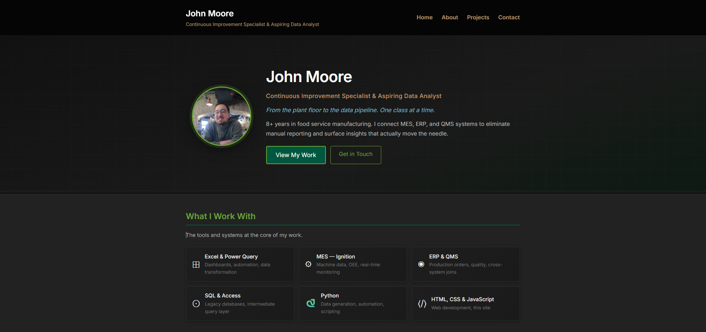
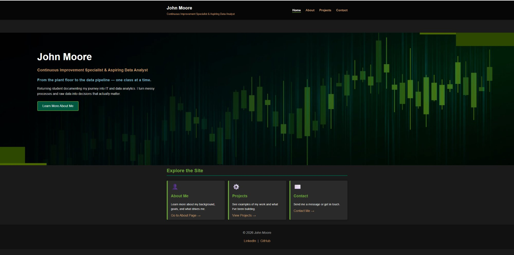

# John Moore — Portfolio Site

A personal portfolio website built for Web Scripting I. The site documents my journey from the plant floor to IT and data analytics, showcasing my professional background, real-world projects, and career goals.

The site uses a dark theme with a green, tan, and steel blue accent system inspired by the GPI brand. All pages share a consistent header, navigation, and footer built with semantic HTML and a single shared CSS file.

---

## Pages

- **Home** (`index.html`) — Landing page with a full-width hero banner and site navigation cards
- **About** (`about.html`) — Bio, career timeline, skills, goals, and hobbies
- **Projects** (`projects.html`) — Ignition MES implementation full case study with YouTube embed, plus five additional projects presented as expandable cards
- **Contact** (`contact.html`) — Contact form with validation and contact info sidebar
- **Landing Page** (`landing.html`) — Standalone portfolio landing page built for the layout assignment (see below)

---

## Assignment 2 — Landing Page Layout

`landing.html` is a standalone portfolio landing page built to satisfy the Mockup B (Portfolio Landing) requirements. It uses a separate stylesheet (`landing.css`) that extends the base theme without affecting any other pages.

### Sections

| Section | Implementation |
|---|---|
| Navbar | Flexbox — brand + 4 nav links |
| Hero | Two-column on desktop (headshot + intro text), stacked on mobile |
| Tools | Full-width band — 6 tool/tech cards in a responsive grid |
| Projects | CSS Grid — 6 cards, 1 → 2 → 3 columns across breakpoints |
| Skills + Timeline | Two-column on desktop — skills list beside a horizontal escalating career timeline |
| Footer | CSS Grid — 3 columns on desktop, stacked on mobile |

### Layout Requirements Met

- ✅ Flexbox for navbar layout
- ✅ CSS Grid for projects section (and footer)
- ✅ Mobile-first with breakpoints at 600px and 900px
- ✅ `.container` class controls max-width throughout

### Design Requirements Met

- ✅ Consistent spacing using CSS custom properties inherited from `styles.css`
- ✅ Consistent typography scale (h1 / h2 / h3)
- ✅ Buttons with hover states (`.btn` and `.btn-outline`)

### Accessibility Requirements Met

- ✅ Single `h1` per page (site name in header)
- ✅ Headings in order — h1 → h2 → h3 throughout
- ✅ Alt text on headshot image
- ✅ `aria-labelledby` on major sections
- ✅ Keyboard accessible (Enter / Space) where applicable

---

## Screenshots

### Landing Page — Desktop


### Landing Page — Mobile


### Homepage — Desktop


---

## File Structure

```
/
├── index.html
├── about.html
├── projects.html
├── contact.html
├── landing.html
├── styles.css
├── landing.css
└── images/
    ├── headshot.jpg
    ├── Hero-Image_DataAnalytics.webp
    ├── screenshot-home.png
    ├── LandingPage1.png
    └── LandingPage1 - Mobile.png
```

---

## Built With

- HTML5 (semantic elements throughout)
- CSS3 (custom design system with `:root` variables, Flexbox, Grid, utility classes, and responsive layout)
- Vanilla JavaScript (expandable project cards on `projects.html` and `landing.html`)
- No frameworks or libraries